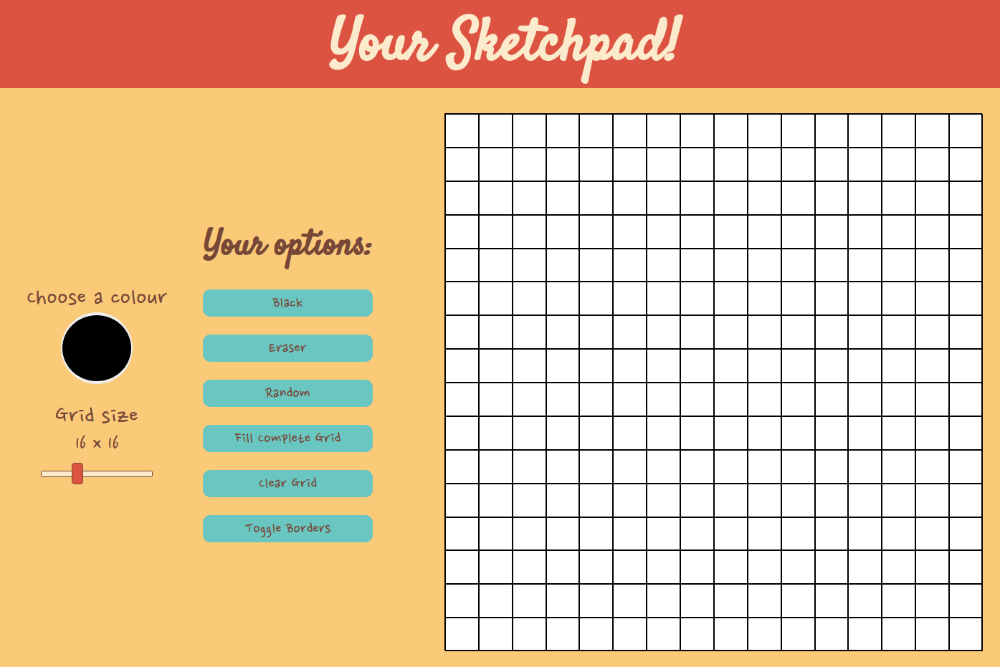

# Etch a Sketch (or Making a Sketchpad)

## Screenshot of my result

## Links

- [View Code](https://github.com/Bayoura/etch-a-sketch)
- [Live Demo](https://bayoura.github.io/etch-a-sketch/)

## Built with

- HTML
- CSS
- Grid
- Flexbox
- Vanilla JavaScript

## What I learned

• I learned more about CSS grid and how to code a resizable grid.  
• I encountered one problem after coding the drawing feature. I wanted the user to be able to push down the mouse button to draw on the grid (and stop drawing as soon as the mouse button was released). This worked fine at first, but there was a weird issue: after pushing down the mouse button the cursor would sometimes change into a closed fist (dragging icon). Instead of drawing it looked like you dragged something. Only after(!) releasing the button you would be able to draw on the grid. You had to click again to get it to stop. This issue was pretty confusing to me because I didn't understand what exactly was happening and what was causing it. After a while I found out how exactly to get the issue to appear: Basically, you could highlight a space in the grid (like you would highlight text) and then this space would be draggable. It was a bit tricky to get to that conclusion, because the highlighted section wasn't visible, and the dragging didn't have any effects (other than interfereing with the drawing function). The problem seemed to be rooted in CSS grid. In the end the solution was fairly easy: I just had to put a `user-select: none` property on my grid container.   
• Making the grid resizable with the range slider proved to be a bit tricky, mainly because it took me a while to figure out how to clear the grid before making a new one (otherwise the new grid cells would just be added to the already existing ones). In the end it was really easy, using `innerHTML`.   
• To make the individual grid cells I used the unit `fr` at first. But with some grid sizes that resulted in a small gap between the grid and the container border on the right side. That's why I changed it and instead calculated the size for each grid cell by dividing the container size by the grid size.   
• I learned more about browser prefixes and cross browser compatibility.  
• I learned about mouse events

## Useful resources

- [A Complete Guide to Grid](https://css-tricks.com/snippets/css/complete-guide-grid/) - This was the first time I actually used grid and this guide definitely helped.
- [Styling Cross-Browser Compatible Range Inputs with CSS](https://css-tricks.com/styling-cross-browser-compatible-range-inputs-css/) - This came in very handy for styling the range input to change the grid size (and making it cross browser compatibile).

## Author

- [codepen](https://codepen.io/bayoura)
- [GitHub](https://github.com/Bayoura)
- [Frontend Mentor](https://www.frontendmentor.io/profile/Bayoura)

